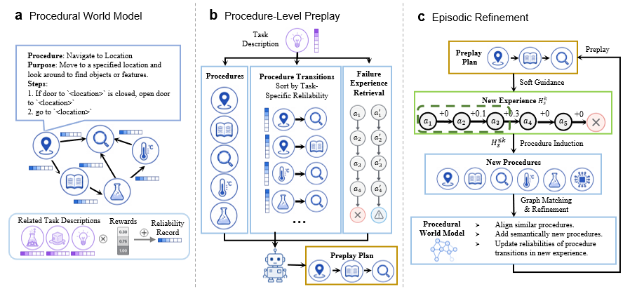

# ProPlay: Procedural Pre-play for Self-Evolving LLM Agents

This is the official implementation of [**ProPlay: Procedural Pre-play for Self-Evolving LLM Agents**]().

ProPlay addresses the problem of self-evolving agents in partially observable environments, where agents must continually refine the internal understanding of environmental dynamics. It introduces a preplay framework built on an evolving procedural world model that encourages continual information exchange between planning and memory under a unified architecture.

---

## ✨ Method Overview

<p align="center">
  
</p>

ProPlay represents environment knowledge as a **procedure graph** where:

- **Nodes** are abstracted procedures induced from successful task trajectories.
- **Directed edges** (procedure transitions) encode induced causal transitions among task stages.
- **Reliability record embeddings** on each edge track how consistently a transition contributed to success on semantically similar tasks.

Each episode follows a three-phase loop:

- **Pre-play**: Before acting, ProPlay queries the procedure world model to construct a *procedural trajectory* as structured soft guidance.
- **Execute**: The agent acts under this guidance while retaining full freedom to deviate and explore.
- **Refine**: After execution, new procedures are induced from successful trajectory fragments, and the world model is refined for future task episodes.

This episodic query–execute–refine loop enables ProPlay to progressively internalize environment dynamics, combining the strengths of **memory** (consolidated procedural knowledge) and **planning** (task-specific trajectory lookahead) based on a unified world model.

---

## 🗂️ Supported Benchmarks

| Benchmark | Domain | Implementation |
|-----------|--------|----------------|
| [ScienceWorld](https://github.com/allenai/ScienceWorld) | Text-based scientific reasoning (23 task types) | `benchmarks/sciworld/` |
| [PlanCraft](https://github.com/gautierdag/plancraft) | Minecraft crafting (187 tasks, 3 difficulty levels) | `benchmarks/plancraft/` |
| [τ-bench](https://github.com/sierra-research/tau-bench) | Customer service tool use (retail & airline) | `benchmarks/taubench/` |

---

## 📦 Project Structure

```
proplay/
├── proplay/                    # Core library (benchmark-agnostic)
│   ├── graph.py                # WorkflowGraph: nodes, edges, reliability record embeddings
│   ├── env.py                  # BaseEnv interface
│   └── llm.py                  # LLMClient 
│
├── benchmarks/
│   ├── sciworld/
│   │   ├── router.py           # SciWorldEnv (AgentGym REST wrapper)
│   │   ├── agent.py            # ProPlay agent: think/act loop
│   │   ├── induction.py        # Procedure induction from episode summaries
│   │   ├── preplay.py          # Pre-play trajectory construction and graph recording
│   │   ├── prompts.py          # LLM prompt templates
│   │   └── pipeline.py         # End-to-end evaluation loop
│   ├── plancraft/
│   │   ├── router.py           # PlanCraft environment wrapper
│   │   ├── agent.py            # ProPlay agent for Minecraft crafting
│   │   ├── induction.py        # Recipe library induction
│   │   ├── preplay.py          # Pre-play for recipe ordering
│   │   ├── prompts/            # Prompt templates
│   │   └── pipeline.py         # Evaluation loop
│   └── taubench/
│       ├── router.py           # tau_bench.envs.get_env wrapper (retail, airline)
│       ├── agent.py            # ProPlay agent with tool-calling support
│       ├── induction.py        # Workflow induction from tool trajectories
│       ├── preplay.py          # Pre-play for tool ordering
│       ├── prompts.py          # Prompt templates
│       ├── llm_client.py       # LLM client with tool-calling extension
│       └── pipeline.py         # Evaluation loop
│
├── data/
│   ├── sciworld/
│   │   ├── gen_online_splits.py    # Generate online evaluation split (shuffled)
│   │   └── splits/                 # Generated by the script above 
│   ├── plancraft/
│   │   ├── gen_splits.py           # Generate evaluation split from plancraft package
│   │   └── splits/                 # Generated by the script above
│   └── taubench/
│       └── load_data.py            # Data loading utilities (data bundled in package)
│
├── prompts/
│   ├── sciworld/               # preplay_instruction.txt, preplay_one_shot.txt
│   ├── plancraft/
│   └── taubench/
│
└── scripts/
    ├── run_sciworld.sh
    ├── run_plancraft.sh
    └── run_taubench.sh
```

---

## 🚀 Installation

```bash
git clone <this-repo>
cd proplay
pip install -e .

# Benchmark-specific dependencies
pip install -e ".[sciworld]"   # ScienceWorld (agentenv-sciworld + scienceworld)
pip install -e ".[plancraft]"  # PlanCraft
# τ-bench — install from source
pip install git+https://github.com/sierra-research/tau-bench
```

---

## ⚙️ Data Preprocessing

Generate task splits before running ProPlay:

```bash
# ScienceWorld
cd data/sciworld
python gen_online_splits.py   # → splits/online_shuffled_ids.json

# PlanCraft (reads val/test splits directly from the installed plancraft package)
cd data/plancraft
python gen_splits.py          # → splits/merged_187_by_complexity.json
```

τ-bench task data is bundled with the `tau_bench` package — no preprocessing needed.

---

## 🔬 Quick Start

### ScienceWorld

```bash
# Start AgentGym SciWorld server
python -m uvicorn agentenv_sciworld.server:app --host 0.0.0.0 --port <your_port> &

export OPENAI_API_KEY=<your_key>
bash scripts/run_sciworld.sh
```

### PlanCraft

```bash
export OPENAI_API_KEY=<your_key>
bash scripts/run_plancraft.sh
```

### τ-bench

```bash
export OPENAI_API_KEY=<your_key>
DOMAIN=retail  bash scripts/run_taubench.sh
DOMAIN=airline bash scripts/run_taubench.sh
```

---

<!-- ## 📚 Citation

If you find this work useful, please cite our paper:

```bibtex
@article{proplay2025,
  title   = {ProPlay: Procedural Pre-play for Self-Evolving LLM Agents},
  author  = {...},
  year    = {2025},
}
``` -->

## 👥 Contact

For questions, please contact `yma7@nd.edu`.
